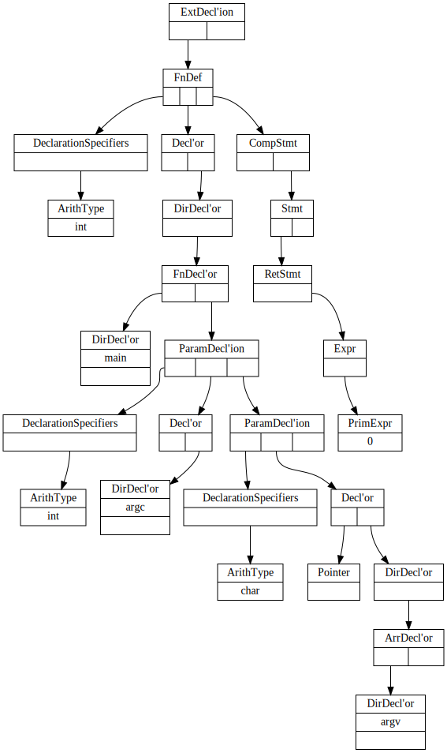

# north-c-interpreter

Yet another hobby project of mine. Currently, only the parser is implemented.

From the following source code:

```C
int main(int argc, char* argv[])
{
  return 0;
}
```

it produces the following graph:



by running the commands:

`./nci example.c | dot -Nfontname=Times\ New\ Roman -Tsvg > example.svg`

The rest may or may not be implemented later.
